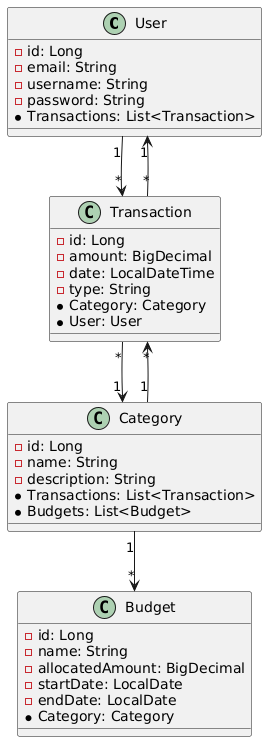
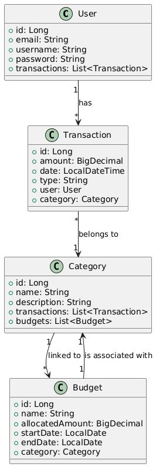

# FinTrack Application

## Overview
FinTrack is a financial tracking application developed as part of our Web Technologies Lab assignments. The application includes features for user management, transaction management, category management, budget tracking, and data visualization. It uses Spring Boot for the backend and Vue.js for the frontend, with GraphQL support for data querying.

## Team Information
**Team Name:** RKJS

**Team Members:**
- Onyedikachi Onah - [onyedikachi.onah001@stud.fh-dortmund.de](mailto:onyedikachi.onah001@stud.fh-dortmund.de)
- Sarvar Abdurakhimov - [sarvar.abdurakhimov006@stud.fh-dortmund.de](mailto:sarvar.abdurakhimov006@stud.fh-dortmund.de)
- Roamilkumar Kachchhi - [roamilkumar.kachchhi001@stud.fh-dortmund.de](mailto:roamilkumar.kachchhi001@stud.fh-dortmund.de)
- Junaid Ahmad - [junaid.ahmad001@stud.fh-dortmund.de](mailto:junaid.ahmad001@stud.fh-dortmund.de)
- Komiljon Yangiboev - [komiljon.yangiboev@stud.fh-dortmund.de](mailto:komiljon.yangiboev@stud.fh-dortmund.de)

**PROJECT DIARY:** [https://docs.google.com/spreadsheets/d/116i_utucOQmKisKY16kUCmlCBGn4R0Im4D5A5mzhsoI/edit?usp=sharing](https://docs.google.com/spreadsheets/d/116i_utucOQmKisKY16kUCmlCBGn4R0Im4D5A5mzhsoI/edit?usp=sharing)

## Features
- User Management (Registration, Login, Update, Delete)
- Transaction Management (CRUD operations)
- Category Management (Add, Update, Delete Categories)
- Budget Management (Track and Plan Spending)
- GraphQL API for advanced data querying
- Vue.js frontend for dynamic interaction

## Web Pages
- **[http://localhost:8080/dashboard](http://localhost:8080/dashboard)** - Displays a dashboard with insights and summaries for the user.
- **[http://localhost:8080/transactions](http://localhost:8080/transactions)** - Provides a list of transactions and allows interaction with transaction data.
- **[http://localhost:8080/login](http://localhost:8080/login)** - User login page for authentication.


## Requirements
To run this project, you will need:
- Java 21
- Maven 3.8+
- Node.js (for frontend integration)
- Spring Boot 3.3.5

### Dependencies
The application includes the following dependencies:
- `spring-boot-starter-web`
- `spring-boot-starter-data-jpa`
- `spring-boot-starter-graphql`
- `spring-boot-starter-thymeleaf`
- `h2` (In-memory database for testing)
- `graphql-java-tools`
- Vue.js (frontend framework)

## Setup Instructions
1. Clone the repository:
   ```bash
   git clone https://github.com/algokano/dortmund-web.git
   cd dortmund-web
   ```

2. Setup Backend:
   ```bash
   cd backend
   mvn clean install
   mvn spring-boot:run
   ```

3. Setup Frontend:
   ```bash
   cd frontend/fintrack-vue
   npm install
   npm run serve
   ```

4. Access the application:
   - **Backend GraphQL Playground:** [http://localhost:8080/graphql](http://localhost:8080/graphql)
   - **Frontend Application:** [http://localhost:8080](http://localhost:8080)

## UML Models
The UML diagrams for the project have been created to represent the entity relationships and system architecture.

- **UML for Entities:**
  

- **System Architecture UML:**
  

## API Endpoints
### REST Endpoints
1. **User Management:**
   - `POST /api/users` - Create a new user
   - `GET /api/users` - Fetch all users
   - `GET /api/users/{id}` - Fetch a user by ID
   - `PUT /api/users/{id}` - Update user details
   - `DELETE /api/users/{id}` - Delete a user

2. **Transaction Management:**
   - `POST /api/transactions` - Create a new transaction
   - `GET /api/transactions` - Fetch all transactions
   - `GET /api/transactions/{id}` - Fetch a transaction by ID
   - `PUT /api/transactions/{id}` - Update transaction details
   - `DELETE /api/transactions/{id}` - Delete a transaction

3. **Category Management:**
   - `POST /api/categories` - Create a new category
   - `GET /api/categories` - Fetch all categories
   - `GET /api/categories/{id}` - Fetch a category by ID
   - `PUT /api/categories/{id}` - Update category details
   - `DELETE /api/categories/{id}` - Delete a category

4. **Budget Management:**
   - `POST /api/budgets` - Create a new budget
   - `GET /api/budgets` - Fetch all budgets
   - `GET /api/budgets/{id}` - Fetch a budget by ID
   - `PUT /api/budgets/{id}` - Update budget details
   - `DELETE /api/budgets/{id}` - Delete a budget
   - `GET /api/budgets/{id}/progress` - Get budget progress

### GraphQL Schema
Refer to the individual lab READMEs for detailed GraphQL queries and mutations.

## Project Structure
```
dortmund-web/
├── backend
│   ├── src
│   ├── target
│   └── pom.xml
├── frontend
│   ├── fintrack-vue
│   ├── frontend-csr
│   └── .gitkeep
└── README.md
```
